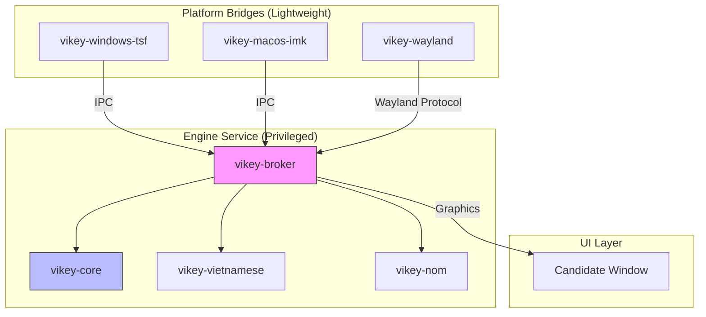

# Kiến Trúc Vikey - Quyết Định Cuối Cùng

> Tài liệu tổng hợp toàn bộ nghiên cứu và chốt phương án kiến trúc, công nghệ cho Vikey.

**Ngày chốt**: 2025-12-05

---

## 1. Triết Lý Thiết Kế

Vikey được thiết kế theo nguyên tắc **Core/Shell Separation** kết hợp **Broker Pattern**:

1. **Core (Lõi)**: Thư viện Rust thuần túy, không phụ thuộc vào UI hay OS cụ thể
2. **Broker (Trung Gian)**: Service/Process có đặc quyền cao để vượt qua các rào cản bảo mật
3. **Shell (Vỏ)**: Các lightweight bridge cho từng platform, chỉ forward keystrokes

---

## 2. Mô Hình Kiến Trúc: Broker Pattern

Sau khi phân tích các ràng buộc bảo mật của Modern OS (Wayland, macOS Secure Input, Windows UIPI), Vikey áp dụng **Broker Pattern**:



### 2.1 Lý Do Chọn Broker Pattern

| Vấn đề                 | Giải pháp bằng Broker Pattern                                    |
| ---------------------- | ---------------------------------------------------------------- |
| **Windows UIPI**       | Broker chạy với `uiAccess=true`, ký số, cài trong Program Files  |
| **macOS Secure Input** | Broker detect và tự động disable để tránh block app              |
| **Wayland Popup**      | Broker giao tiếp với Compositor qua `zwp_input_popup_surface_v2` |
| **Đồng bộ từ điển**    | Broker giữ state duy nhất, các bridge chỉ forward keystrokes     |
| **Mobile Sandbox**     | Core logic offline-first, không yêu cầu `INTERNET` mặc định      |

---

## 3. Cấu Trúc Crates

```
vikey/
├── crates/
│   ├── vikey-core/           # 🔵 Core engine (Platform Agnostic)
│   │   ├── src/
│   │   │   ├── buffer.rs     # Ring buffer management
│   │   │   ├── state.rs      # State machine
│   │   │   ├── processor.rs  # Key processing
│   │   │   └── action.rs     # Output actions
│   │   └── Cargo.toml
│   │
│   ├── vikey-vietnamese/     # 🟢 Tiếng Việt hiện đại
│   │   ├── src/
│   │   │   ├── telex.rs      # Telex transformer
│   │   │   ├── vni.rs        # VNI transformer
│   │   │   ├── tone.rs       # Tone placement algorithm
│   │   │   └── tables.rs     # Character tables (DT-style)
│   │   └── Cargo.toml
│   │
│   ├── vikey-nom/            # 🟡 Chữ Nôm & Tiếng Việt cổ
│   │   ├── src/
│   │   │   ├── nom.rs        # Nôm transformer
│   │   │   └── dict.rs       # Nôm dictionary (Wiktionary data)
│   │   └── Cargo.toml
│   │
│   ├── vikey-broker/         # 🟣 Engine Service (Privileged)
│   │   ├── src/
│   │   │   ├── ipc.rs        # IPC server (Named Pipe/Unix Socket)
│   │   │   ├── service.rs    # Windows Service / macOS LaunchAgent
│   │   │   └── config.rs     # Configuration management
│   │   └── Cargo.toml
│   │
│   └── platform/             # 🟠 Platform Bridges
│       ├── vikey-windows-tsf/    # Windows TSF DLL
│       ├── vikey-macos-imk/      # macOS InputMethodKit Bundle
│       └── vikey-wayland/        # Linux Wayland IME
│
├── Cargo.toml                # Workspace root
└── docs/
    └── ARCHITECTURE.md       # File này
```

---

## 4. Công Nghệ & Kỹ Thuật Cuối Cùng

### 4.1 Core Engine (`vikey-core`, `vikey-vietnamese`)

| Thành Phần            | Công Nghệ                      | Lý Do                                        |
| --------------------- | ------------------------------ | -------------------------------------------- |
| **Character Lookup**  | `const [u32; 128]` + `HashMap` | Hybrid: O(1) cho ASCII, O(1) avg cho Unicode |
| **Buffer**            | `Vec<char>` với Ring buffer    | Rust ownership, no-alloc hot path            |
| **State Machine**     | Rust `enum` exhaustive match   | Compile-time guarantee cho transitions       |
| **Unicode Normalize** | `unicode-normalization` crate  | Chuẩn NFC bắt buộc cho input                 |
| **Tone Placement**    | Port từ UniKey (DT algorithm)  | 20+ năm proven, tối ưu về tốc độ             |

### 4.2 Platform Bridges

| Platform    | Công Nghệ                        | Protocol/API                  |
| ----------- | -------------------------------- | ----------------------------- |
| **Windows** | Rust + `windows-rs`              | TSF (Text Services Framework) |
| **macOS**   | Swift wrapper + Rust FFI         | InputMethodKit                |
| **Wayland** | `zwp-input-method-service` crate | `input-method-v2` protocol    |
| **X11**     | `x11rb` crate (legacy support)   | XIM protocol                  |
| **Android** | Rust + JNI                       | Android IME SDK               |

### 4.3 IPC & Broker

| Thành Phần        | Công Nghệ                      | Lý Do                            |
| ----------------- | ------------------------------ | -------------------------------- |
| **IPC Protocol**  | Named Pipe (Win) / Unix Socket | Platform native, low latency     |
| **Serialization** | `serde` + `bincode`            | Zero-copy, compact binary format |
| **Service**       | `windows-service` / launchd    | OS-native service management     |
| **Config**        | TOML files                     | Human readable, Rust ecosystem   |

### 4.4 Chữ Nôm (`vikey-nom`)

| Thành Phần     | Công Nghệ               | Lý Do                            |
| -------------- | ----------------------- | -------------------------------- |
| **Dictionary** | FST (`fst` crate)       | Memory-efficient, fast lookup    |
| **Data**       | `rime-ime-han-nom-data` | Proven Telex→Nôm mapping         |
| **Fallback**   | OpenCC-style conversion | Hán Việt → Nôm character options |

### 4.5 UI (Candidate Window)

| Platform    | Công Nghệ                      | Lý Do                              |
| ----------- | ------------------------------ | ---------------------------------- |
| **Windows** | WinUI 3 hoặc `egui`            | Modern, hardware accelerated       |
| **macOS**   | SwiftUI                        | Native macOS look & feel           |
| **Wayland** | `zwlr_layer_shell_v1` + `egui` | Overlay layer, Compositor position |
| **Theming** | CSS-like config (TOML)         | User customizable                  |

---

## 5. Quyết Định Thiết Kế Quan Trọng

### 5.1 Hot Path Optimization (Học từ UniKey)

```rust
// Bit-packed lookup table cho ký tự thường gặp (O(1))
const CHAR_ATTRS: [u32; 128] = [
    // Bit layout: [vowel_idx:5][tone_idx:4][flags:23]
    // Precomputed at compile time
];

#[inline(always)]
fn is_vowel(c: char) -> bool {
    if c.is_ascii() {
        (CHAR_ATTRS[c as usize] & 0x1F) > 0
    } else {
        VOWEL_SET.contains(&c)
    }
}
```

### 5.2 Modular Transformer (Học từ OpenKey)

```rust
// Trait cho các input method
pub trait Transformer: Send + Sync {
    fn name(&self) -> &str;
    fn transform(&self, buffer: &Buffer, key: KeyEvent) -> Option<TransformResult>;
    fn can_undo(&self, buffer: &Buffer) -> bool;
}

// Dễ mở rộng cho các ngôn ngữ khác
pub struct TelexTransformer;
pub struct VNITransformer;
pub struct NomTransformer;
pub struct TaiVietTransformer;
```

### 5.3 Secure Mode Detection

```rust
// Tự động disable khi gặp password field
pub trait SecureModeAware {
    fn is_secure_mode(&self) -> bool;
}

impl Processor {
    pub fn process_key(&mut self, event: KeyEvent) -> Action {
        if self.platform.is_secure_mode() {
            return Action::Passthrough; // Không xử lý
        }
        // ...
    }
}
```

### 5.4 Offline-First Strategy

```rust
// Không yêu cầu network cho core functionality
pub struct Config {
    pub cloud_sync: CloudSyncConfig,
}

pub struct CloudSyncConfig {
    pub enabled: bool,  // Default: false (opt-in)
    pub agent: Option<PathBuf>,  // Separate process
}
```

---

## 6. Performance Targets

| Metric            | Target  | Cách đạt được                        |
| ----------------- | ------- | ------------------------------------ |
| Latency/keystroke | < 5ms   | Bit-packed tables, no-alloc hot path |
| Memory usage      | < 15MB  | FST dictionary, lazy loading         |
| Binary size       | < 2MB   | LTO, strip symbols                   |
| Startup time      | < 100ms | Lazy initialization, async dict load |
| IPC roundtrip     | < 1ms   | Unix Socket/Named Pipe, bincode      |

---

## 7. Phụ Thuộc Chính (Dependencies)

### Core Crates

```toml
[dependencies]
# Unicode
unicode-normalization = "0.1"

# Serialization
serde = { version = "1.0", features = ["derive"] }
bincode = "1.3"

# Config
toml = "0.8"

# Logging
tracing = "0.1"
```

### Platform-Specific

```toml
# Windows
[target.'cfg(windows)'.dependencies]
windows = { version = "0.52", features = ["Win32_UI_TextServices"] }

# Wayland
[target.'cfg(target_os = "linux")'.dependencies]
zwp-input-method-service = "0.1"
wayland-client = "0.31"

# Dictionary
fst = "0.4"
```

---

## 8. Luồng Xử Lý (Processing Flow)

```
User Input → Platform Bridge → IPC → Broker → Processor → Transform → IPC → Output
```

1. **User Input**: Người dùng gõ phím
2. **Platform Bridge**: Bắt KeyEvent từ OS (TSF/IMK/Wayland)
3. **IPC**: Forward qua Named Pipe/Unix Socket tới Broker
4. **Broker**: Nhận request, dispatch tới Processor
5. **Processor**: Xử lý event, quản lý buffer và state
6. **Transform**: Áp dụng quy tắc tiếng Việt (Telex/VNI/Nôm)
7. **IPC**: Trả về Action qua IPC
8. **Output**: Platform Bridge thực hiện Replace/Commit

---

## 9. Tóm Tắt Quyết Định

| Khía Cạnh        | Quyết Định                                        |
| ---------------- | ------------------------------------------------- |
| **Architecture** | Broker Pattern + Core/Shell Separation            |
| **Lookup**       | Hybrid: const array + HashMap                     |
| **Performance**  | UniKey-style bit manipulation cho hot path        |
| **Platform**     | TSF (Win), IMK (macOS), input-method-v2 (Wayland) |
| **IPC**          | Named Pipe/Unix Socket + bincode                  |
| **Dictionary**   | FST (Finite State Transducer)                     |
| **Config**       | TOML files                                        |
| **Network**      | Offline-first, Cloud Sync opt-in                  |
| **Security**     | Auto-detect Secure Mode, passthrough              |

### Trade-offs Đã Chấp Nhận

1. **Complexity**: Broker pattern phức tạp hơn monolithic
2. **IPC Overhead**: ~1ms latency thêm cho mỗi keystroke (chấp nhận được)
3. **Build Complexity**: Cần build riêng cho từng platform
4. **Chữ Nôm Data**: Phụ thuộc vào `rime-ime-han-nom-data` (GPL)

---

## 10. Các Phương Pháp BẤT HỢP LỆ (KHÔNG Được Sử Dụng)

> [!CAUTION]
> Các phương pháp sau đây vi phạm security model của OS và KHÔNG được sử dụng trong Vikey.

### 10.1 Windows

| Phương Pháp Bất Hợp Lệ           | Lý Do Cấm                                           |
| -------------------------------- | --------------------------------------------------- |
| **SetWindowsHookEx (Global)**    | Không phải API chính thức cho IME, bị chặn bởi UIPI |
| **Raw Input hooking**            | Không dành cho text input, có thể bị block          |
| **DLL injection**                | Vi phạm bảo mật, antivirus sẽ flag                  |
| **Memory patching**              | Vi phạm EULA Windows, không ổn định                 |
| **Driver-level keyboard filter** | Yêu cầu ký kernel driver, quá phức tạp              |
| **Chạy không có code signing**   | uiAccess yêu cầu bắt buộc phải ký số                |

**Phương pháp hợp lệ**: Sử dụng **TSF (Text Services Framework)** với code signing.

### 10.2 macOS

| Phương Pháp Bất Hợp Lệ              | Lý Do Cấm                                   |
| ----------------------------------- | ------------------------------------------- |
| **CGEventTap không có permission**  | Sẽ fail silently hoặc bị system chặn        |
| **Cố hoạt động trong Secure Input** | Không thể, OS chặn hoàn toàn                |
| **KEXT (Kernel Extension)**         | Apple deprecated, không cho phép từ Big Sur |
| **Phân phối không notarized**       | Gatekeeper sẽ chặn                          |
| **Yêu cầu SIP disable**             | Không hợp lý cho end-user software          |

**Phương pháp hợp lệ**: Sử dụng **InputMethodKit** với notarization và code signing.

### 10.3 Linux/Wayland

| Phương Pháp Bất Hợp Lệ         | Lý Do Cấm                                 |
| ------------------------------ | ----------------------------------------- |
| **XGrabKeyboard trên Wayland** | Không hoạt động, Wayland không hỗ trợ     |
| **/dev/input trực tiếp**       | Yêu cầu root, không có tọa độ cursor      |
| **libinput hooking**           | Chỉ dành cho compositor, không cho client |
| **Fake X11 server**            | Phức tạp, không ổn định                   |

**Phương pháp hợp lệ**: Sử dụng **zwp_input_method_v2 protocol**.

### 10.4 Nguyên Tắc Chung

1. ❌ **KHÔNG** sử dụng bất kỳ phương pháp nào yêu cầu disable security features của OS
2. ❌ **KHÔNG** cố hoạt động khi OS đã chủ động chặn (Secure Input Mode)
3. ❌ **KHÔNG** sử dụng driver-level hooks khi có API user-space
4. ❌ **KHÔNG** phân phối binary không có code signing trên platforms yêu cầu
5. ✅ **CHỈ** sử dụng các API được thiết kế và khuyến khích bởi OS vendor

---

**Last Updated**: 2025-12-05
