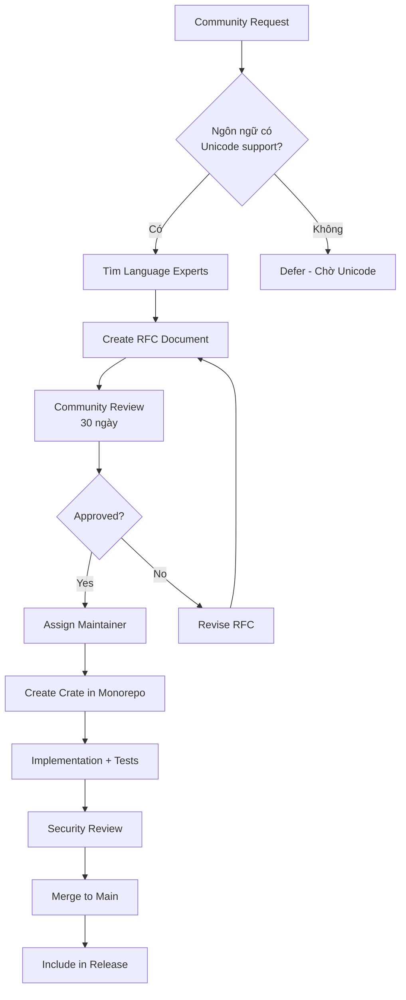

# Phân Tích Chuyên Sâu: Plugin System vs Monorepo cho Dự Án Cấp Quốc Gia

> Đánh giá kiến trúc mở rộng cho dự án IME có độ quan trọng cao (cấp chính phủ)

**Ngày phân tích**: 2025-12-05  
**Độ quan trọng**: 🔴 CRITICAL

---

## 1. Bối Cảnh: Tại Sao Đây Là Quyết Định Quan Trọng

### 1.1 Đặc Thù Dự Án Cấp Quốc Gia

| Yếu Tố                | Yêu Cầu                                    |
| --------------------- | ------------------------------------------ |
| **Security**          | Zero tolerance cho vulnerabilities         |
| **Stability**         | Không được crash, phải hoạt động 24/7      |
| **Auditability**      | Có thể audit toàn bộ codebase              |
| **Supply Chain**      | Kiểm soát chặt dependencies                |
| **Long-term Support** | Duy trì 10-20 năm                          |
| **Certification**     | Có thể cần chứng nhận Common Criteria/FIPS |

### 1.2 Các Lựa Chọn Kiến Trúc

```
┌─────────────────────────────────────────────────────────────────────┐
│                    Option A: Monorepo (Closed Extension)            │
│                                                                     │
│  Tất cả input methods nằm trong CÙNG MỘT repository                │
│  Dev muốn thêm bộ gõ → Fork + PR → Review → Merge                  │
│                                                                     │
│  Examples: UniKey, OpenKey                                          │
└─────────────────────────────────────────────────────────────────────┘

┌─────────────────────────────────────────────────────────────────────┐
│                    Option B: Plugin System (Open Extension)         │
│                                                                     │
│  Core engine + Plugin interface                                     │
│  Dev viết plugin riêng → Load at runtime                           │
│                                                                     │
│  Examples: RIME (Lua), VSCode, Sublime Text                        │
└─────────────────────────────────────────────────────────────────────┘

┌─────────────────────────────────────────────────────────────────────┐
│                    Option C: Hybrid (Curated Plugins)               │
│                                                                     │
│  Core + Official plugins (in monorepo)                             │
│  Community plugins (separate, với signing requirement)             │
│                                                                     │
│  Examples: Firefox (WebExtensions), Chrome, iOS/Android            │
└─────────────────────────────────────────────────────────────────────┘
```

---

## 2. Phân Tích Chi Tiết Từng Option

### 2.1 Option A: Monorepo (Khuyến Nghị Cho Cấp Quốc Gia)

```
vikey/
├── crates/
│   ├── vikey-core/              # Core engine
│   ├── vikey-vietnamese/        # Official: Tiếng Việt
│   ├── vikey-nom/               # Official: Chữ Nôm
│   ├── vikey-tai/               # Official: Chữ Thái
│   ├── vikey-cham/              # Official: Chữ Chăm
│   ├── vikey-hmong/             # Official: Chữ H'Mông
│   └── ...                      # Tất cả input methods
└── platform/                    # Platform bridges
```

#### Ưu Điểm

| Ưu Điểm                     | Giải Thích                                 |
| --------------------------- | ------------------------------------------ |
| **100% Auditability**       | Toàn bộ code trong 1 repo, audit được hết  |
| **Unified Build**           | Một lệnh build tất cả, tối ưu hóa toàn cục |
| **No Runtime Loading Risk** | Không có code được load lúc runtime        |
| **Single Version Control**  | Tất cả components có cùng version          |
| **Compile-time Safety**     | Rust compiler check toàn bộ                |
| **Dependency Control**      | Kiểm soát 100% dependencies                |
| **Simpler Certification**   | Dễ đạt chứng nhận bảo mật (CC, FIPS)       |

#### Nhược Điểm

| Nhược Điểm               | Mitigation                                       |
| ------------------------ | ------------------------------------------------ |
| **Slower Contribution**  | ➜ Clear contribution guide + Fast review process |
| **Repo Size Grows**      | ➜ Git LFS cho data files                         |
| **Core Team Bottleneck** | ➜ Trusted maintainers cho từng language          |
| **Release Coupling**     | ➜ Feature flags cho optional components          |

#### Quy Trình Đóng Góp

```
Developer muốn thêm ngôn ngữ mới (ví dụ: Chữ Ê-đê):

1. Fork vikey/vikey repository
2. Tạo crate: crates/vikey-ede/
3. Implement LanguagePlugin trait
4. Viết tests, docs
5. Submit PR
6. Review bởi:
   - Core maintainers (code quality, security)
   - Language experts (linguistic accuracy)
7. Merge vào main
8. Bao gồm trong next release
```

### 2.2 Option B: Plugin System (KHÔNG Khuyến Nghị)

#### Tại Sao Plugin System Nguy Hiểm Cho Critical Infrastructure

```
┌─────────────────────────────────────────────────────────────────────┐
│                    ATTACK SURFACE ANALYSIS                          │
├─────────────────────────────────────────────────────────────────────┤
│                                                                     │
│  ┌─────────────┐     ┌─────────────┐     ┌─────────────┐           │
│  │ Malicious   │────▶│   Plugin    │────▶│   Vikey     │           │
│  │   Plugin    │     │   Loader    │     │   Core      │           │
│  └─────────────┘     └─────────────┘     └─────────────┘           │
│        │                   │                   │                    │
│        ▼                   ▼                   ▼                    │
│  ┌─────────────────────────────────────────────────────┐           │
│  │              KEYSTROKE ACCESS                       │           │
│  │         (Every single key user types)               │           │
│  └─────────────────────────────────────────────────────┘           │
│                                                                     │
│  Risk: Plugin có thể là KEYLOGGER                                  │
│                                                                     │
└─────────────────────────────────────────────────────────────────────┘
```

#### Các Rủi Ro Cụ Thể

| Rủi Ro                   | Severity    | Mô Tả                                 |
| ------------------------ | ----------- | ------------------------------------- |
| **Keylogging**           | 🔴 Critical | Plugin capture mọi keystroke          |
| **Data Exfiltration**    | 🔴 Critical | Plugin gửi dữ liệu ra ngoài           |
| **Code Injection**       | 🔴 Critical | Plugin inject code vào processes khác |
| **Privilege Escalation** | 🟠 High     | Plugin exploit IME privileges         |
| **Supply Chain Attack**  | 🟠 High     | Malicious update pushed to plugin     |
| **Dependency Confusion** | 🟠 High     | Plugin dùng malicious dependencies    |

#### WASM Sandbox Không Đủ An Toàn

```rust
// WASM sandbox CÓ THỂ bị bypass trong một số trường hợp

// 1. Side-channel attacks (Spectre/Meltdown variants)
// 2. WASM implementation bugs
// 3. Resource exhaustion (DoS)
// 4. Sandbox escape qua host functions

// Ví dụ: Plugin cần gọi host function để commit text
#[wasm_bindgen]
extern "C" {
    fn host_commit_text(text: &str);  // ← Attack vector
    fn host_get_buffer() -> String;   // ← Có thể leak data
}
```

### 2.3 Option C: Hybrid (Curated Plugins)

```
┌─────────────────────────────────────────────────────────────────────┐
│                          VIKEY ECOSYSTEM                            │
├─────────────────────────────────────────────────────────────────────┤
│                                                                     │
│  ┌─────────────────────────────────────────────────────┐           │
│  │              OFFICIAL (In Monorepo)                 │           │
│  │                                                     │           │
│  │  vikey-vietnamese  vikey-nom  vikey-tai  vikey-cham │           │
│  │                                                     │           │
│  │  ✅ Full audit    ✅ Signed    ✅ Certified          │           │
│  └─────────────────────────────────────────────────────┘           │
│                                                                     │
│  ┌─────────────────────────────────────────────────────┐           │
│  │           COMMUNITY (Separate, Signed)              │           │
│  │                                                     │           │
│  │  vikey-ede (Ê-đê)   vikey-bahnar   vikey-jarai     │           │
│  │                                                     │           │
│  │  ⚠️ Self-signed    ⚠️ User consent    ⚠️ Sandbox    │           │
│  └─────────────────────────────────────────────────────┘           │
│                                                                     │
└─────────────────────────────────────────────────────────────────────┘
```

#### Vấn Đề Với Hybrid

1. **Phân mảnh**: Một số ngôn ngữ "official", một số không
2. **User confusion**: User không biết plugin nào an toàn
3. **Maintenance burden**: Phải maintain 2 hệ thống
4. **Signing infrastructure**: Cần PKI riêng cho plugin signing

---

## 3. Đề Xuất: Monorepo + Trusted Maintainers

### 3.1 Cấu Trúc Tổ Chức

```
┌─────────────────────────────────────────────────────────────────────┐
│                        VIKEY GOVERNANCE                             │
├─────────────────────────────────────────────────────────────────────┤
│                                                                     │
│  ┌─────────────────────────────────────────────────────┐           │
│  │                   CORE TEAM                         │           │
│  │            (Security, Architecture)                 │           │
│  └────────────────────────┬────────────────────────────┘           │
│                           │                                         │
│           ┌───────────────┼───────────────┐                         │
│           ▼               ▼               ▼                         │
│  ┌─────────────┐  ┌─────────────┐  ┌─────────────┐                 │
│  │ Vietnamese  │  │    Nôm      │  │   Ethnic    │                 │
│  │ Maintainers │  │ Maintainers │  │ Maintainers │                 │
│  │             │  │             │  │             │                 │
│  │ • Experts   │  │ • Scholars  │  │ • Community │                 │
│  │ • Linguists │  │ • Historians│  │ • Leaders   │                 │
│  └─────────────┘  └─────────────┘  └─────────────┘                 │
│                                                                     │
│  Mỗi maintainer group:                                              │
│  - Có write access cho crate của mình                               │
│  - Chịu trách nhiệm review PRs                                      │
│  - Được Core team trust                                             │
│                                                                     │
└─────────────────────────────────────────────────────────────────────┘
```

### 3.2 Quy Trình Thêm Ngôn Ngữ Mới



### 3.3 Feature Flags Cho Optional Languages

```toml
# Cargo.toml

[features]
default = ["vietnamese"]

# Core languages (enabled by default)
vietnamese = ["vikey-vietnamese"]

# Optional languages (opt-in)
nom = ["vikey-nom"]
ethnic = ["vikey-tai", "vikey-cham", "vikey-hmong", "vikey-ede"]

# Full bundle
full = ["vietnamese", "nom", "ethnic"]
```

```rust
// Build với chỉ tiếng Việt (nhỏ gọn)
cargo build

// Build với chữ Nôm
cargo build --features nom

// Build đầy đủ (cho government deployment)
cargo build --features full
```

---

## 4. So Sánh Với Các Dự Án Tương Tự

### 4.1 Dự Án INPUT METHOD Cấp Quốc Gia

| Project          | Country    | Architecture | Plugin? | Notes                            |
| ---------------- | ---------- | ------------ | ------- | -------------------------------- |
| **Sogou**        | China      | Monolith     | No      | Government concerns → no plugins |
| **Baidu IME**    | China      | Monolith     | No      | All features built-in            |
| **GBoard**       | USA/Global | Monolith     | No      | Google controls all              |
| **iOS Keyboard** | USA        | Monolith     | Limited | Third-party keyboards sandboxed  |
| **SCIM/IBus**    | Community  | Plugin       | Yes     | NOT for government use           |
| **RIME**         | Community  | Schema+Lua   | Yes     | Flexibility > Security           |

### 4.2 Dự Án Bảo Mật Cấp Quốc Gia (Tham Khảo)

| Project               | Type    | Extension Model                        |
| --------------------- | ------- | -------------------------------------- |
| **Linux Kernel**      | OS      | Monorepo, kext phải signed và audit    |
| **OpenSSL**           | Crypto  | Monorepo, NO plugins                   |
| **BoringSSL**         | Crypto  | Fork của OpenSSL, even stricter        |
| **Chromium (Gov Ed)** | Browser | Enterprise policies disable extensions |
| **Firefox ESR**       | Browser | Enterprise policies limit extensions   |

---

## 5. Kết Luận & Khuyến Nghị

### 5.1 Khuyến Nghị Chính

> **🔴 KHÔNG DÙNG PLUGIN SYSTEM cho dự án cấp quốc gia**

Lý do:

1. **Attack Surface**: Plugin = potential keylogger
2. **Supply Chain**: Không kiểm soát được source
3. **Certification**: Khó đạt chứng nhận bảo mật
4. **Liability**: Ai chịu trách nhiệm khi plugin malicious?

### 5.2 Kiến Trúc Đề Xuất

```
┌─────────────────────────────────────────────────────────────────────┐
│                    VIKEY - MONOREPO ARCHITECTURE                    │
├─────────────────────────────────────────────────────────────────────┤
│                                                                     │
│  crates/                                                            │
│  ├── vikey-core/              # 🔵 Platform-agnostic engine        │
│  ├── vikey-vietnamese/        # 🟢 Tiếng Việt (Telex, VNI, VIQR)   │
│  ├── vikey-nom/               # 🟡 Chữ Nôm                         │
│  ├── vikey-tai/               # 🟠 Chữ Thái (Tày, Nùng, Thái)      │
│  ├── vikey-cham/              # 🔴 Chữ Chăm                        │
│  ├── vikey-hmong/             # 🟣 Chữ H'Mông                      │
│  ├── vikey-ede/               # ⚫ Tiếng Ê-đê                       │
│  ├── vikey-bahnar/            # ⚪ Tiếng Ba Na                      │
│  └── vikey-[language]/        # ➕ Thêm bằng PR, không plugin      │
│                                                                     │
│  Tất cả trong CÙNG repository:                                      │
│  ✅ Single source of truth                                          │
│  ✅ Unified version control                                         │
│  ✅ Full auditability                                               │
│  ✅ Certifiable                                                     │
│                                                                     │
└─────────────────────────────────────────────────────────────────────┘
```

### 5.3 Cho Developer Muốn Đóng Góp

```
Bạn muốn thêm ngôn ngữ mới?

1. Fork https://github.com/vikey/vikey
2. Tạo crate: crates/vikey-[language]/
3. Implement LanguagePlugin trait
4. Viết tests (coverage > 80%)
5. Viết docs (README, API docs)
6. Submit PR
7. Review process (~2-4 tuần)
8. Merge vào main
9. Bạn trở thành maintainer cho crate đó

Không cần plugin system - Đóng góp trực tiếp vào codebase chính!
```

### 5.4 Lộ Trình

| Phase | Mục Tiêu                            | Timeline   |
| ----- | ----------------------------------- | ---------- |
| 1     | Core + Vietnamese (Telex, VNI)      | Q1 2025    |
| 2     | Chữ Nôm                             | Q2 2025    |
| 3     | Chữ Thái, Chăm, H'Mông              | Q3-Q4 2025 |
| 4     | Ethnic languages (community-driven) | 2026+      |

---

## 6. Tóm Tắt

| Câu Hỏi                               | Trả Lời                                      |
| ------------------------------------- | -------------------------------------------- |
| **Plugin system có ổn không?**        | ❌ KHÔNG cho dự án cấp quốc gia              |
| **User/dev đóng góp như thế nào?**    | ✅ Fork + PR vào monorepo                    |
| **Làm sao đảm bảo security?**         | ✅ Code review + Trusted maintainers         |
| **Làm sao scale cho nhiều ngôn ngữ?** | ✅ Mỗi ngôn ngữ = 1 crate, 1 maintainer team |

---

**Last Updated**: 2025-12-05
